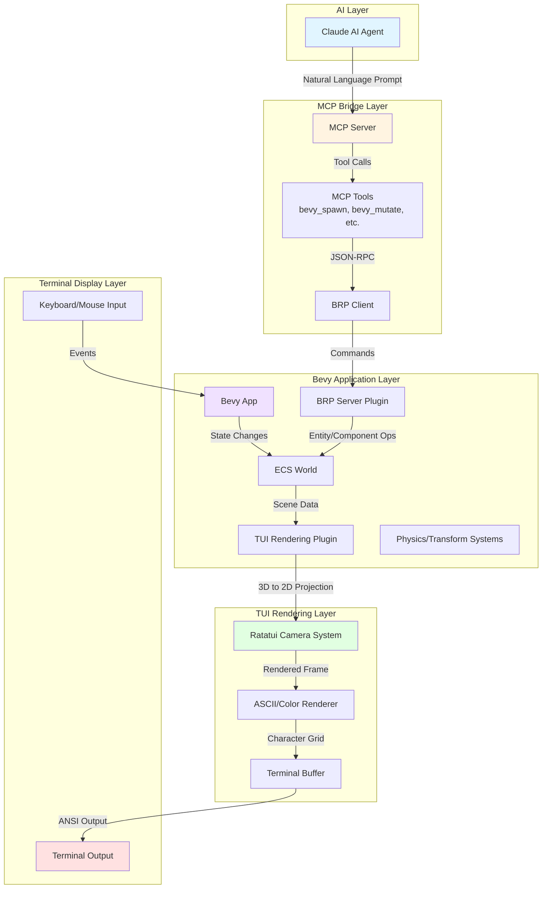
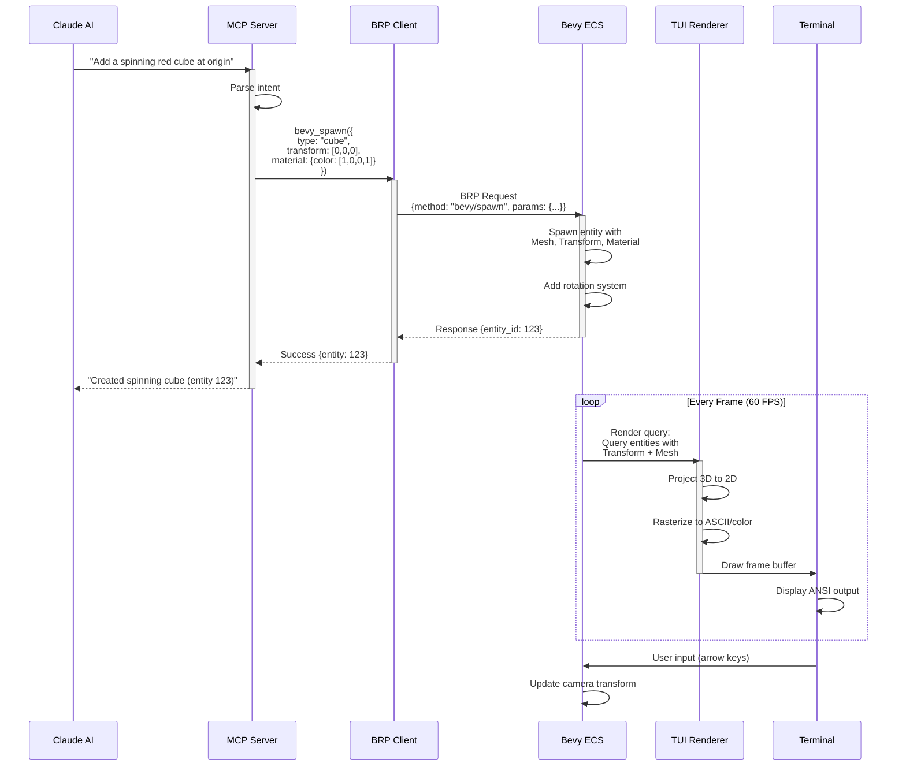
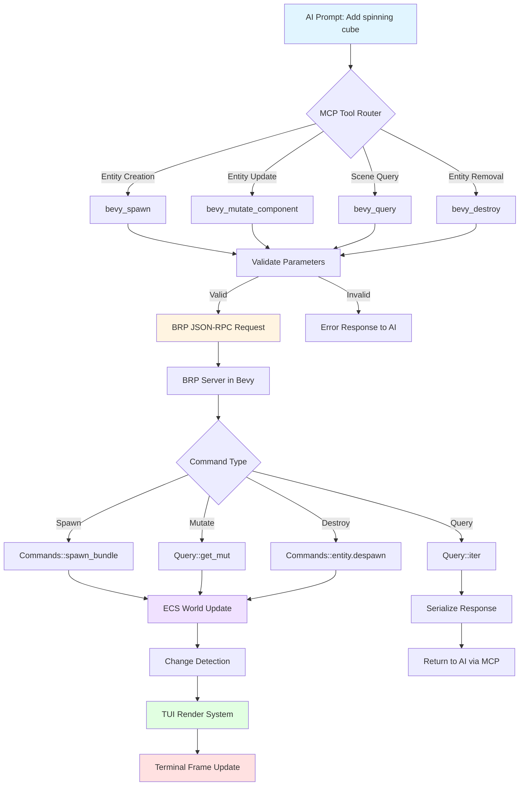
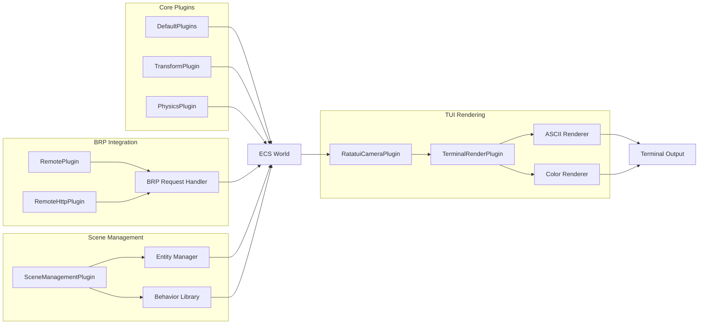
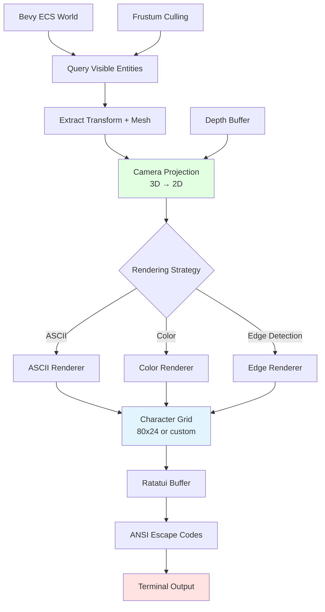
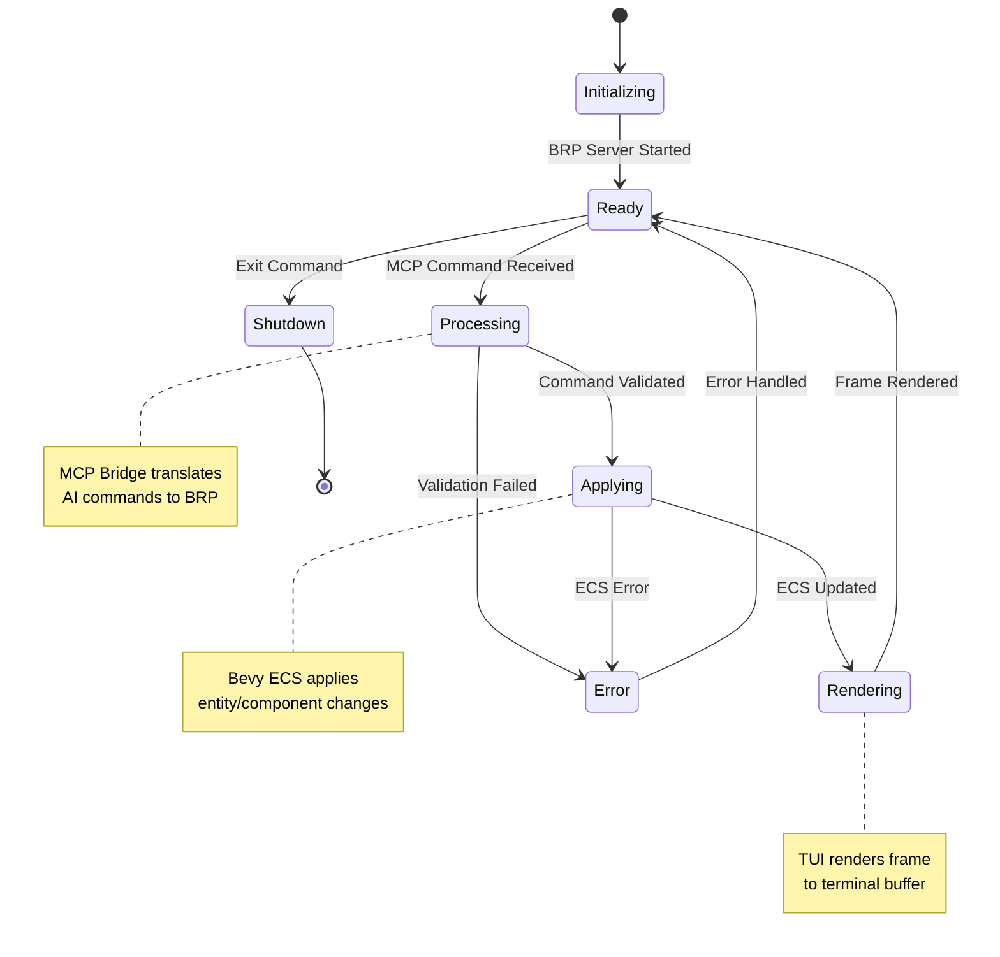
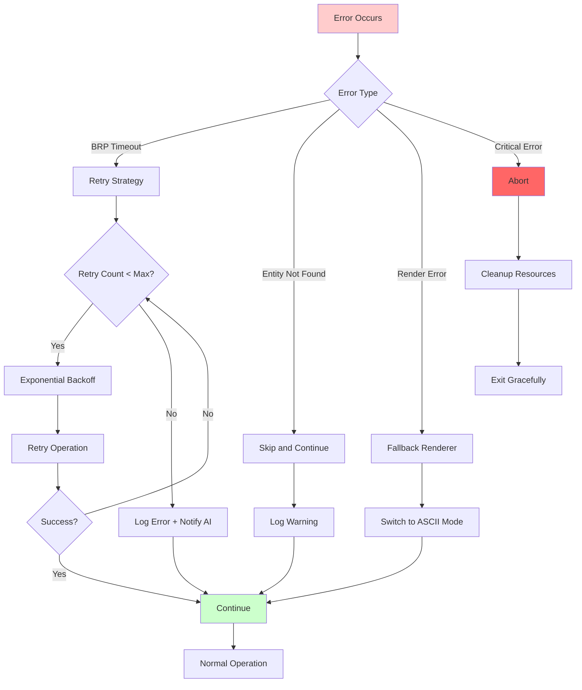
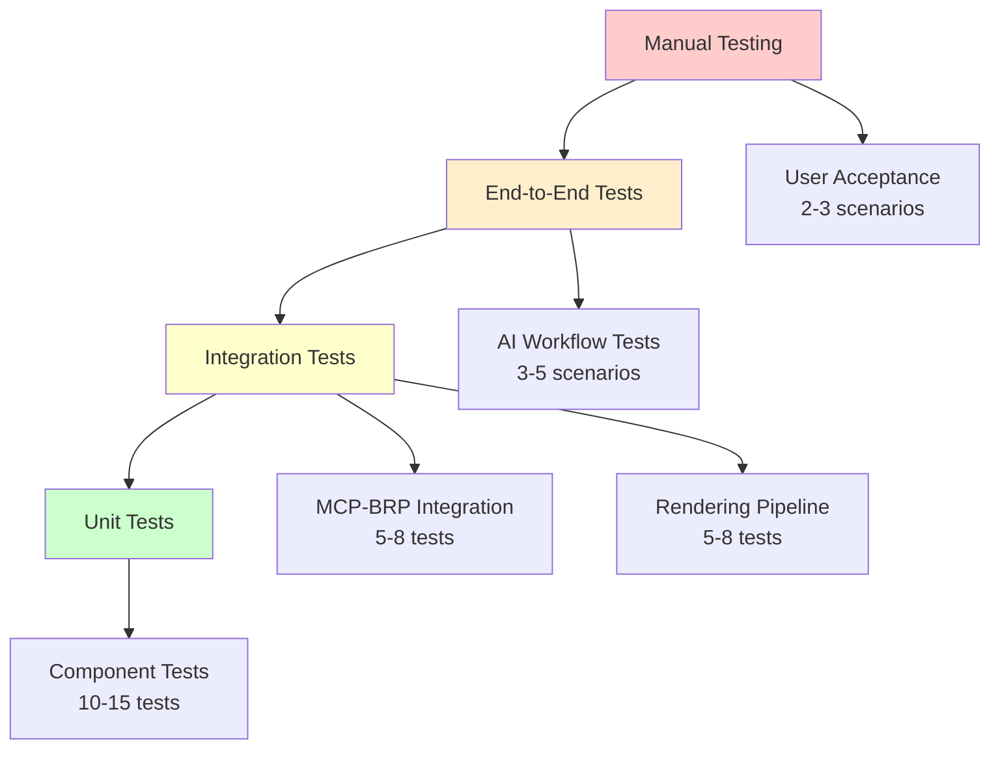
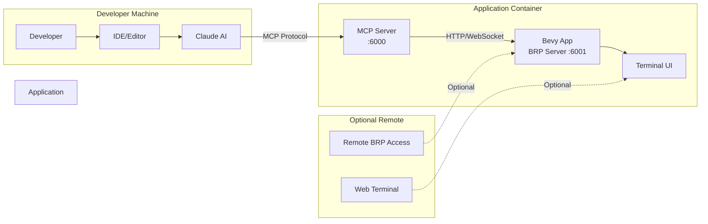

# System Architecture: AI-Driven Bevy MCP TUI Reference Application

## Executive Summary

This document describes the architecture of a reference implementation that enables AI-driven control and visualization of 3D scenes rendered in a terminal user interface (TUI). The system bridges AI prompts through the Model Context Protocol (MCP) to a Bevy game engine application that renders real-time 3D graphics to the terminal using ratatui.

**Key Innovation**: Combining Bevy's ECS architecture with terminal rendering and AI control through MCP, enabling natural language interaction with 3D scenes in a text-based environment.

---

## 1. System Overview

### 1.1 High-Level Architecture

The system consists of five primary layers:

1. **AI Layer**: Claude (or other AI) generates commands via natural language
2. **MCP Bridge Layer**: Translates AI intentions into Bevy Remote Protocol (BRP) commands
3. **Bevy Application Layer**: ECS-based 3D scene management and simulation
4. **TUI Rendering Layer**: Converts 3D scene to terminal-compatible output
5. **Terminal Display Layer**: User interaction and visual output



### 1.2 Component Responsibilities

| Component | Responsibility | Key Technologies |
|-----------|---------------|------------------|
| AI Layer | Natural language understanding, scene composition planning | Claude API, MCP Protocol |
| MCP Bridge | Command translation, error handling, state synchronization | MCP SDK, BRP Client |
| Bevy App | Scene management, physics, entity lifecycle | Bevy 0.16+, ECS |
| TUI Rendering | 3D→2D projection, ASCII/color rendering | bevy_ratatui_camera, ratatui |
| Terminal Display | User I/O, visual output | Terminal emulator (ANSI) |

---

## 2. Data Flow Architecture

### 2.1 End-to-End Data Flow



### 2.2 Command Flow: AI Prompt to Scene Update



---

## 3. Component Architecture

### 3.1 Bevy Application Structure

```rust
// Main application structure
pub struct BevyMcpTuiApp {
    // Core Bevy app
    app: App,

    // Plugin configuration
    config: AppConfig,
}

// Plugin architecture
impl Plugin for BevyMcpTuiApp {
    fn build(&self, app: &mut App) {
        app
            // Core systems
            .add_plugins(DefaultPlugins)

            // BRP integration for MCP
            .add_plugins(RemotePlugin::default())
            .add_plugins(RemoteHttpPlugin::default())

            // TUI rendering
            .add_plugins(RatatuiCameraPlugin)
            .add_plugins(TerminalRenderPlugin)

            // Scene management
            .add_plugins(SceneManagementPlugin)

            // Physics and simulation
            .add_plugins(TransformPlugin)
            .add_plugins(PhysicsPlugin)

            // Custom systems
            .add_systems(Update, (
                handle_user_input,
                update_camera_controls,
                apply_entity_behaviors,
            ))
            .add_systems(PostUpdate, (
                project_scene_to_terminal,
                render_terminal_frame,
            ));
    }
}
```

### 3.2 Plugin Responsibilities



---

## 4. MCP Tool Integration

### 4.1 MCP Tool Definitions

The MCP server exposes the following tools for AI interaction:

#### Tool: `bevy_spawn`

Creates a new entity in the Bevy scene.

```json
{
  "name": "bevy_spawn",
  "description": "Spawn a new entity in the Bevy 3D scene",
  "inputSchema": {
    "type": "object",
    "properties": {
      "entity_type": {
        "type": "string",
        "enum": ["cube", "sphere", "plane", "custom"],
        "description": "Type of entity to spawn"
      },
      "transform": {
        "type": "object",
        "properties": {
          "translation": {"type": "array", "items": {"type": "number"}, "minItems": 3, "maxItems": 3},
          "rotation": {"type": "array", "items": {"type": "number"}, "minItems": 4, "maxItems": 4},
          "scale": {"type": "array", "items": {"type": "number"}, "minItems": 3, "maxItems": 3}
        }
      },
      "material": {
        "type": "object",
        "properties": {
          "color": {"type": "array", "items": {"type": "number"}, "minItems": 4, "maxItems": 4},
          "metallic": {"type": "number", "minimum": 0, "maximum": 1},
          "roughness": {"type": "number", "minimum": 0, "maximum": 1}
        }
      },
      "behaviors": {
        "type": "array",
        "items": {
          "type": "string",
          "enum": ["rotate", "orbit", "bounce", "scale_pulse"]
        }
      }
    },
    "required": ["entity_type"]
  }
}
```

#### Tool: `bevy_mutate_component`

Modifies component values on existing entities.

```json
{
  "name": "bevy_mutate_component",
  "description": "Modify components on an existing entity",
  "inputSchema": {
    "type": "object",
    "properties": {
      "entity_id": {"type": "integer", "description": "Entity ID to modify"},
      "component": {"type": "string", "enum": ["Transform", "Material", "Visibility"]},
      "values": {"type": "object", "description": "Component-specific values to update"}
    },
    "required": ["entity_id", "component", "values"]
  }
}
```

#### Tool: `bevy_query`

Queries entities and components in the scene.

```json
{
  "name": "bevy_query",
  "description": "Query entities and their components",
  "inputSchema": {
    "type": "object",
    "properties": {
      "filter": {
        "type": "object",
        "properties": {
          "components": {"type": "array", "items": {"type": "string"}},
          "bounds": {
            "type": "object",
            "properties": {
              "min": {"type": "array", "items": {"type": "number"}},
              "max": {"type": "array", "items": {"type": "number"}}
            }
          }
        }
      },
      "limit": {"type": "integer", "minimum": 1, "maximum": 1000}
    }
  }
}
```

#### Tool: `bevy_destroy`

Removes entities from the scene.

```json
{
  "name": "bevy_destroy",
  "description": "Remove an entity from the scene",
  "inputSchema": {
    "type": "object",
    "properties": {
      "entity_id": {"type": "integer"}
    },
    "required": ["entity_id"]
  }
}
```

#### Tool: `bevy_camera_control`

Controls the TUI camera position and settings.

```json
{
  "name": "bevy_camera_control",
  "description": "Control the terminal camera view",
  "inputSchema": {
    "type": "object",
    "properties": {
      "action": {
        "type": "string",
        "enum": ["set_position", "look_at", "set_projection", "set_render_mode"]
      },
      "parameters": {"type": "object"}
    },
    "required": ["action"]
  }
}
```

### 4.2 MCP-to-BRP Translation Layer

```rust
// MCP Tool Handler
pub struct McpBrpBridge {
    brp_client: BrpClient,
    entity_registry: Arc<RwLock<EntityRegistry>>,
}

impl McpBrpBridge {
    pub async fn handle_tool_call(
        &self,
        tool_name: &str,
        params: serde_json::Value,
    ) -> Result<ToolResponse, BridgeError> {
        match tool_name {
            "bevy_spawn" => self.handle_spawn(params).await,
            "bevy_mutate_component" => self.handle_mutate(params).await,
            "bevy_query" => self.handle_query(params).await,
            "bevy_destroy" => self.handle_destroy(params).await,
            "bevy_camera_control" => self.handle_camera(params).await,
            _ => Err(BridgeError::UnknownTool(tool_name.to_string())),
        }
    }

    async fn handle_spawn(&self, params: serde_json::Value) -> Result<ToolResponse, BridgeError> {
        // Parse MCP parameters
        let spawn_params: SpawnParams = serde_json::from_value(params)?;

        // Translate to BRP request
        let brp_request = BrpRequest {
            jsonrpc: "2.0".to_string(),
            method: "bevy/spawn".to_string(),
            params: Some(json!({
                "components": self.build_component_bundle(&spawn_params),
            })),
            id: RequestId::Number(self.next_request_id()),
        };

        // Send to Bevy via BRP
        let response = self.brp_client.send(brp_request).await?;

        // Register entity for future reference
        if let Some(entity_id) = response.result.get("entity") {
            self.entity_registry.write().await.register(
                entity_id.as_u64().unwrap(),
                spawn_params.entity_type.clone(),
            );
        }

        // Return MCP response
        Ok(ToolResponse {
            content: vec![ToolResponseContent::Text {
                text: format!("Spawned {} at entity ID {}",
                    spawn_params.entity_type,
                    response.result.get("entity").unwrap()),
            }],
        })
    }
}
```

---

## 5. TUI Rendering Architecture

### 5.1 Rendering Pipeline



### 5.2 Rendering Strategies

```rust
// Rendering strategy trait
pub trait RenderStrategy: Send + Sync {
    fn render(
        &self,
        projected_vertices: &[Vec2],
        faces: &[Face],
        material: &Material,
        depth: f32,
    ) -> char;

    fn color(&self, material: &Material, depth: f32) -> Color;
}

// ASCII Renderer: Uses character density
pub struct AsciiRenderer {
    charset: Vec<char>, // From dense to sparse: @%#*+=-:.
}

impl RenderStrategy for AsciiRenderer {
    fn render(&self, projected_vertices: &[Vec2], faces: &[Face], material: &Material, depth: f32) -> char {
        let density = self.calculate_density(faces, depth);
        let index = (density * (self.charset.len() - 1) as f32) as usize;
        self.charset[index.min(self.charset.len() - 1)]
    }

    fn color(&self, _material: &Material, _depth: f32) -> Color {
        Color::White // ASCII mode uses monochrome
    }
}

// Color Renderer: Uses Unicode blocks with RGB colors
pub struct ColorRenderer;

impl RenderStrategy for ColorRenderer {
    fn render(&self, _projected_vertices: &[Vec2], _faces: &[Face], _material: &Material, _depth: f32) -> char {
        '█' // Full block character
    }

    fn color(&self, material: &Material, depth: f32) -> Color {
        let base_color = material.base_color;
        let fog_factor = (depth / 50.0).clamp(0.0, 1.0);
        Color::Rgb(
            (base_color.r() * (1.0 - fog_factor) * 255.0) as u8,
            (base_color.g() * (1.0 - fog_factor) * 255.0) as u8,
            (base_color.b() * (1.0 - fog_factor) * 255.0) as u8,
        )
    }
}

// Edge Renderer: Renders wireframes with edge detection
pub struct EdgeRenderer;

impl RenderStrategy for EdgeRenderer {
    fn render(&self, projected_vertices: &[Vec2], faces: &[Face], _material: &Material, _depth: f32) -> char {
        // Detect edge pixels using normal comparison
        if self.is_edge_pixel(faces) {
            '│' // Box drawing character
        } else {
            ' '
        }
    }

    fn color(&self, material: &Material, _depth: f32) -> Color {
        Color::Rgb(
            (material.base_color.r() * 255.0) as u8,
            (material.base_color.g() * 255.0) as u8,
            (material.base_color.b() * 255.0) as u8,
        )
    }
}
```

### 5.3 Camera System

```rust
// Ratatui Camera Component
#[derive(Component)]
pub struct RatatuiCamera {
    // View parameters
    pub fov: f32,
    pub aspect_ratio: f32,
    pub near_clip: f32,
    pub far_clip: f32,

    // Terminal dimensions
    pub width: u16,
    pub height: u16,

    // Rendering configuration
    pub render_strategy: Box<dyn RenderStrategy>,
    pub show_grid: bool,
    pub show_axes: bool,
}

impl RatatuiCamera {
    pub fn project(&self, world_pos: Vec3, view_matrix: Mat4, proj_matrix: Mat4) -> Option<(u16, u16, f32)> {
        // View-projection transform
        let clip_pos = proj_matrix * view_matrix * world_pos.extend(1.0);

        // Perspective divide
        if clip_pos.w <= 0.0 {
            return None; // Behind camera
        }
        let ndc = clip_pos / clip_pos.w;

        // Frustum culling
        if ndc.x.abs() > 1.0 || ndc.y.abs() > 1.0 || ndc.z < 0.0 || ndc.z > 1.0 {
            return None;
        }

        // Map to terminal coordinates
        let screen_x = ((ndc.x + 1.0) * 0.5 * self.width as f32) as u16;
        let screen_y = ((1.0 - ndc.y) * 0.5 * self.height as f32) as u16;

        Some((screen_x, screen_y, ndc.z))
    }
}

// TUI Rendering System
pub fn render_scene_to_terminal(
    mut terminal: ResMut<Terminal<CrosstermBackend<Stdout>>>,
    camera_query: Query<(&RatatuiCamera, &Transform)>,
    entities_query: Query<(&Transform, &Handle<Mesh>, &Handle<StandardMaterial>)>,
    meshes: Res<Assets<Mesh>>,
    materials: Res<Assets<StandardMaterial>>,
) {
    let (camera, camera_transform) = camera_query.single();

    // Build view and projection matrices
    let view_matrix = camera_transform.compute_matrix().inverse();
    let proj_matrix = Mat4::perspective_rh(
        camera.fov,
        camera.aspect_ratio,
        camera.near_clip,
        camera.far_clip,
    );

    // Create frame buffer
    let mut frame_buffer = FrameBuffer::new(camera.width, camera.height);

    // Render each entity
    for (transform, mesh_handle, material_handle) in entities_query.iter() {
        let mesh = meshes.get(mesh_handle).unwrap();
        let material = materials.get(material_handle).unwrap();

        // Project vertices
        let world_matrix = transform.compute_matrix();
        for vertex in mesh.vertices() {
            let world_pos = world_matrix.transform_point3(vertex.position);

            if let Some((x, y, depth)) = camera.project(world_pos, view_matrix, proj_matrix) {
                let ch = camera.render_strategy.render(&[], &[], material, depth);
                let color = camera.render_strategy.color(material, depth);
                frame_buffer.set(x, y, ch, color, depth);
            }
        }
    }

    // Draw to terminal
    terminal.draw(|f| {
        frame_buffer.render(f, f.size());
    }).unwrap();
}
```

---

## 6. State Management and Synchronization

### 6.1 State Architecture



### 6.2 State Synchronization

The system maintains consistency across layers through:

#### Entity Registry

```rust
// Shared entity registry for MCP-to-Bevy mapping
pub struct EntityRegistry {
    entities: HashMap<u64, EntityMetadata>,
    name_to_id: HashMap<String, u64>,
}

#[derive(Clone)]
pub struct EntityMetadata {
    pub entity_id: u64,
    pub entity_type: String,
    pub name: Option<String>,
    pub tags: Vec<String>,
    pub created_at: SystemTime,
}

impl EntityRegistry {
    pub fn register(&mut self, id: u64, metadata: EntityMetadata) {
        if let Some(name) = &metadata.name {
            self.name_to_id.insert(name.clone(), id);
        }
        self.entities.insert(id, metadata);
    }

    pub fn lookup_by_name(&self, name: &str) -> Option<u64> {
        self.name_to_id.get(name).copied()
    }

    pub fn get_metadata(&self, id: u64) -> Option<&EntityMetadata> {
        self.entities.get(&id)
    }
}
```

#### Change Detection

```rust
// Bevy change detection for incremental updates
pub fn detect_scene_changes(
    changed_transforms: Query<Entity, Changed<Transform>>,
    changed_materials: Query<Entity, Changed<Handle<StandardMaterial>>>,
    removed_entities: RemovedComponents<Transform>,
    mut change_notifier: ResMut<ChangeNotifier>,
) {
    // Track transformed entities
    for entity in changed_transforms.iter() {
        change_notifier.mark_changed(entity, ChangeType::Transform);
    }

    // Track material changes
    for entity in changed_materials.iter() {
        change_notifier.mark_changed(entity, ChangeType::Material);
    }

    // Track removed entities
    for entity in removed_entities.read() {
        change_notifier.mark_removed(entity);
    }
}

// Notify MCP bridge of changes for AI awareness
pub fn notify_mcp_of_changes(
    change_notifier: Res<ChangeNotifier>,
    mut mcp_bridge: ResMut<McpBrpBridge>,
) {
    for change in change_notifier.drain_changes() {
        mcp_bridge.send_notification(McpNotification::SceneChanged {
            entity_id: change.entity.index(),
            change_type: change.change_type,
        });
    }
}
```

#### Frame Synchronization

```rust
// Synchronize rendering with Bevy's frame rate
pub struct FrameSyncConfig {
    pub target_fps: u32,
    pub vsync: bool,
    pub frame_budget_ms: f32,
}

pub fn synchronize_frame_rate(
    time: Res<Time>,
    config: Res<FrameSyncConfig>,
    mut last_render: Local<f64>,
) -> ShouldRun {
    let frame_duration = 1.0 / config.target_fps as f64;
    let elapsed = time.elapsed_seconds_f64() - *last_render;

    if elapsed >= frame_duration {
        *last_render = time.elapsed_seconds_f64();
        ShouldRun::Yes
    } else {
        ShouldRun::No
    }
}
```

---

## 7. Error Handling and Recovery

### 7.1 Error Hierarchy

```rust
// Comprehensive error types
#[derive(Debug, thiserror::Error)]
pub enum BevyMcpError {
    // BRP Communication Errors
    #[error("BRP connection failed: {0}")]
    BrpConnectionError(String),

    #[error("BRP request timeout after {0}ms")]
    BrpTimeout(u64),

    #[error("BRP protocol error: {0}")]
    BrpProtocolError(String),

    // MCP Bridge Errors
    #[error("Invalid MCP tool parameters: {0}")]
    InvalidToolParams(String),

    #[error("Unknown entity ID: {0}")]
    EntityNotFound(u64),

    #[error("Component not found on entity {entity}: {component}")]
    ComponentNotFound { entity: u64, component: String },

    // Rendering Errors
    #[error("Terminal rendering failed: {0}")]
    RenderError(String),

    #[error("Invalid terminal dimensions: {width}x{height}")]
    InvalidDimensions { width: u16, height: u16 },

    // Scene Errors
    #[error("Invalid mesh data: {0}")]
    InvalidMesh(String),

    #[error("Asset loading failed: {0}")]
    AssetLoadError(String),
}

// Error recovery strategies
pub enum RecoveryStrategy {
    Retry { max_attempts: u32, backoff_ms: u64 },
    Fallback { alternative: Box<dyn Fn() -> Result<(), BevyMcpError>> },
    SkipAndContinue,
    Abort,
}

impl BevyMcpError {
    pub fn recovery_strategy(&self) -> RecoveryStrategy {
        match self {
            BevyMcpError::BrpTimeout(_) => RecoveryStrategy::Retry {
                max_attempts: 3,
                backoff_ms: 100,
            },
            BevyMcpError::EntityNotFound(_) => RecoveryStrategy::SkipAndContinue,
            BevyMcpError::RenderError(_) => RecoveryStrategy::Fallback {
                alternative: Box::new(|| {
                    // Fall back to basic ASCII rendering
                    Ok(())
                }),
            },
            _ => RecoveryStrategy::Abort,
        }
    }
}
```

### 7.2 Error Handling Flow



### 7.3 Graceful Degradation

```rust
// Implement graceful degradation for rendering
pub struct RenderingContext {
    primary_renderer: Box<dyn RenderStrategy>,
    fallback_renderers: Vec<Box<dyn RenderStrategy>>,
    current_renderer_index: usize,
}

impl RenderingContext {
    pub fn render_with_fallback(&mut self, /* ... */) -> Result<(), BevyMcpError> {
        let result = self.try_render(self.current_renderer_index);

        if result.is_err() && self.current_renderer_index < self.fallback_renderers.len() {
            // Fall back to simpler renderer
            self.current_renderer_index += 1;
            warn!("Falling back to renderer {}", self.current_renderer_index);
            return self.render_with_fallback(/* ... */);
        }

        result
    }
}
```

---

## 8. Extensibility Points

### 8.1 Plugin Extension Architecture

```rust
// Custom plugin trait for extending functionality
pub trait BevyMcpExtension: Plugin {
    // Register custom MCP tools
    fn register_mcp_tools(&self, registry: &mut ToolRegistry);

    // Register custom rendering strategies
    fn register_render_strategies(&self, strategies: &mut RenderStrategyRegistry);

    // Register custom entity behaviors
    fn register_behaviors(&self, behaviors: &mut BehaviorRegistry);

    // Add custom systems
    fn add_systems(&self, app: &mut App);
}

// Example: Physics extension
pub struct PhysicsExtension;

impl BevyMcpExtension for PhysicsExtension {
    fn register_mcp_tools(&self, registry: &mut ToolRegistry) {
        registry.register(Box::new(ApplyForceTool));
        registry.register(Box::new(SetGravityTool));
        registry.register(Box::new(CreateConstraintTool));
    }

    fn register_behaviors(&self, behaviors: &mut BehaviorRegistry) {
        behaviors.register("gravity", Box::new(GravityBehavior::default()));
        behaviors.register("collision", Box::new(CollisionBehavior::default()));
    }

    fn add_systems(&self, app: &mut App) {
        app.add_systems(Update, (
            apply_gravity,
            detect_collisions,
            resolve_constraints,
        ));
    }
}
```

### 8.2 Custom Renderer Extension

```rust
// Users can implement custom rendering strategies
pub struct CustomVoxelRenderer {
    voxel_size: f32,
    palette: Vec<Color>,
}

impl RenderStrategy for CustomVoxelRenderer {
    fn render(&self, projected_vertices: &[Vec2], faces: &[Face], material: &Material, depth: f32) -> char {
        // Custom voxel-based rendering logic
        let voxel_index = self.compute_voxel_index(projected_vertices, depth);
        self.get_voxel_char(voxel_index)
    }

    fn color(&self, material: &Material, depth: f32) -> Color {
        // Quantize to palette
        self.nearest_palette_color(material.base_color)
    }
}

// Register custom renderer
app.resource_mut::<RenderStrategyRegistry>()
    .register("voxel", Box::new(CustomVoxelRenderer::default()));
```

### 8.3 Behavior System Extension

```rust
// Extensible behavior system for entity animation
pub trait EntityBehavior: Send + Sync {
    fn update(&mut self, entity: Entity, transform: &mut Transform, time: &Time);
}

pub struct RotationBehavior {
    axis: Vec3,
    speed: f32,
}

impl EntityBehavior for RotationBehavior {
    fn update(&mut self, _entity: Entity, transform: &mut Transform, time: &Time) {
        let rotation = Quat::from_axis_angle(self.axis, self.speed * time.delta_seconds());
        transform.rotation *= rotation;
    }
}

// Behavior registry
pub struct BehaviorRegistry {
    behaviors: HashMap<String, Box<dyn EntityBehavior>>,
}

// System to apply behaviors
pub fn apply_entity_behaviors(
    mut query: Query<(Entity, &mut Transform, &BehaviorList)>,
    behaviors: Res<BehaviorRegistry>,
    time: Res<Time>,
) {
    for (entity, mut transform, behavior_list) in query.iter_mut() {
        for behavior_name in &behavior_list.0 {
            if let Some(behavior) = behaviors.get_mut(behavior_name) {
                behavior.update(entity, &mut transform, &time);
            }
        }
    }
}
```

### 8.4 Future Extension Points

Planned extensibility features:

1. **Custom Entity Types**
   - User-defined mesh generators
   - Procedural geometry plugins
   - Custom material shaders (terminal-compatible)

2. **Advanced Rendering**
   - Ray-marching renderer for volumetric effects
   - Particle system renderer
   - Post-processing effects (dithering, bloom approximation)

3. **Input Handling**
   - Custom control schemes
   - Gesture recognition in terminal
   - Macro recording and playback

4. **AI Integration**
   - Custom MCP tools for domain-specific operations
   - AI-driven camera cinematography
   - Procedural scene generation from natural language

5. **Networking**
   - Multi-user terminal sessions
   - Shared scene collaboration
   - Remote BRP access

---

## 9. Implementation Roadmap

### Phase 1: Core Infrastructure (Weeks 1-2)

- [ ] Set up Bevy 0.16 project structure
- [ ] Implement BRP server plugin integration
- [ ] Create basic MCP server with BRP client
- [ ] Implement entity registry and state management
- [ ] Basic error handling framework

### Phase 2: TUI Rendering (Weeks 3-4)

- [ ] Integrate bevy_ratatui_camera
- [ ] Implement ASCII renderer
- [ ] Implement color renderer
- [ ] Add camera projection and controls
- [ ] Frame rate synchronization

### Phase 3: MCP Tool Suite (Week 5)

- [ ] Implement `bevy_spawn` tool
- [ ] Implement `bevy_mutate_component` tool
- [ ] Implement `bevy_query` tool
- [ ] Implement `bevy_destroy` tool
- [ ] Implement `bevy_camera_control` tool

### Phase 4: Scene Management (Week 6)

- [ ] Entity behavior system
- [ ] Prefab/template system
- [ ] Scene serialization/deserialization
- [ ] Asset loading pipeline

### Phase 5: Polish and Extensions (Weeks 7-8)

- [ ] Edge detection renderer
- [ ] Interactive TUI controls
- [ ] Performance optimization
- [ ] Documentation and examples
- [ ] Extension API finalization

### Phase 6: Testing and Release (Week 9)

- [ ] Integration testing
- [ ] Performance benchmarking
- [ ] User acceptance testing
- [ ] Documentation completion
- [ ] Release preparation

---

## 10. Performance Considerations

### 10.1 Optimization Targets

| Metric | Target | Measurement |
|--------|--------|-------------|
| Frame Rate | 30-60 FPS | Terminal rendering latency |
| BRP Latency | < 10ms | MCP tool call round-trip |
| Entity Limit | 1000+ | Concurrent entities in scene |
| Memory Usage | < 100MB | Resident set size |
| Startup Time | < 2s | Application initialization |

### 10.2 Optimization Strategies

```rust
// Spatial partitioning for efficient queries
pub struct SceneSpatialIndex {
    octree: Octree<Entity>,
    dirty_entities: HashSet<Entity>,
}

impl SceneSpatialIndex {
    pub fn query_region(&self, bounds: Aabb) -> Vec<Entity> {
        self.octree.query(bounds)
    }

    pub fn update_entity(&mut self, entity: Entity, transform: &Transform) {
        self.octree.update(entity, transform.translation);
        self.dirty_entities.remove(&entity);
    }
}

// Frustum culling before projection
pub fn frustum_cull_entities(
    mut visible_entities: ResMut<VisibleEntities>,
    camera_query: Query<(&RatatuiCamera, &Transform)>,
    entities_query: Query<(Entity, &Transform, &Aabb)>,
) {
    let (camera, camera_transform) = camera_query.single();
    let frustum = Frustum::from_camera(camera, camera_transform);

    visible_entities.clear();
    for (entity, transform, aabb) in entities_query.iter() {
        let world_aabb = aabb.transform(transform);
        if frustum.intersects(&world_aabb) {
            visible_entities.insert(entity);
        }
    }
}

// Level-of-detail for distant objects
pub struct LodSystem {
    lod_distances: Vec<f32>, // [10.0, 20.0, 50.0]
}

impl LodSystem {
    pub fn select_mesh(&self, distance: f32) -> LodLevel {
        for (i, &threshold) in self.lod_distances.iter().enumerate() {
            if distance < threshold {
                return LodLevel(i);
            }
        }
        LodLevel(self.lod_distances.len())
    }
}
```

### 10.3 Rendering Optimizations

```rust
// Character buffer pooling to reduce allocations
pub struct FrameBufferPool {
    buffers: Vec<FrameBuffer>,
    in_use: Vec<bool>,
}

impl FrameBufferPool {
    pub fn acquire(&mut self, width: u16, height: u16) -> FrameBufferHandle {
        for (i, buffer) in self.buffers.iter_mut().enumerate() {
            if !self.in_use[i] && buffer.dimensions() == (width, height) {
                self.in_use[i] = true;
                return FrameBufferHandle(i);
            }
        }

        // Allocate new buffer if none available
        self.buffers.push(FrameBuffer::new(width, height));
        self.in_use.push(true);
        FrameBufferHandle(self.buffers.len() - 1)
    }

    pub fn release(&mut self, handle: FrameBufferHandle) {
        self.in_use[handle.0] = false;
    }
}

// Incremental rendering: only update changed regions
pub struct IncrementalRenderer {
    last_frame: FrameBuffer,
    dirty_regions: Vec<Rect>,
}

impl IncrementalRenderer {
    pub fn render_incremental(&mut self, current_frame: &FrameBuffer) {
        for region in &self.dirty_regions {
            // Only re-render changed areas
            self.render_region(current_frame, *region);
        }
        self.dirty_regions.clear();
    }
}
```

---

## 11. Security Considerations

### 11.1 Threat Model

**Attack Vectors**:
1. Malicious MCP commands (resource exhaustion, invalid state)
2. BRP injection attacks
3. Terminal escape sequence injection
4. Unauthorized entity access
5. Denial of service via rapid tool calls

### 11.2 Security Measures

```rust
// Input validation and sanitization
pub struct CommandValidator {
    max_entities: usize,
    max_component_size: usize,
    rate_limiter: RateLimiter,
}

impl CommandValidator {
    pub fn validate_spawn(&self, params: &SpawnParams) -> Result<(), ValidationError> {
        // Validate entity count
        if self.entity_count() >= self.max_entities {
            return Err(ValidationError::EntityLimitExceeded);
        }

        // Validate parameter sizes
        if serde_json::to_vec(params)?.len() > self.max_component_size {
            return Err(ValidationError::ComponentTooLarge);
        }

        // Validate numeric ranges
        self.validate_transform(&params.transform)?;
        self.validate_material(&params.material)?;

        Ok(())
    }

    pub fn check_rate_limit(&mut self) -> Result<(), ValidationError> {
        if !self.rate_limiter.allow() {
            return Err(ValidationError::RateLimitExceeded);
        }
        Ok(())
    }
}

// Escape sequence sanitization for terminal output
pub fn sanitize_terminal_output(text: &str) -> String {
    // Remove potentially dangerous ANSI sequences
    let mut sanitized = String::with_capacity(text.len());
    let mut in_escape = false;

    for ch in text.chars() {
        match ch {
            '\x1b' => in_escape = true,
            'm' if in_escape => in_escape = false,
            _ if !in_escape => sanitized.push(ch),
            _ => {}
        }
    }

    sanitized
}
```

### 11.3 Resource Limits

```rust
// Resource quotas
pub struct ResourceLimits {
    pub max_entities: usize,          // 1000
    pub max_vertices_per_mesh: usize, // 10000
    pub max_textures: usize,          // 100
    pub max_materials: usize,         // 100
    pub max_commands_per_second: u32, // 100
    pub memory_limit_mb: usize,       // 500
}

// Monitor and enforce resource limits
pub fn enforce_resource_limits(
    limits: Res<ResourceLimits>,
    entity_count: Query<Entity>,
    mut commands: Commands,
) {
    if entity_count.iter().count() > limits.max_entities {
        // Remove oldest entities (FIFO)
        warn!("Entity limit exceeded, removing oldest entities");
        // Implementation...
    }
}
```

---

## 12. Testing Strategy

### 12.1 Test Pyramid



### 12.2 Test Categories

#### Unit Tests

```rust
#[cfg(test)]
mod tests {
    use super::*;

    #[test]
    fn test_camera_projection() {
        let camera = RatatuiCamera {
            fov: PI / 4.0,
            aspect_ratio: 16.0 / 9.0,
            near_clip: 0.1,
            far_clip: 100.0,
            width: 80,
            height: 24,
            // ...
        };

        let world_pos = Vec3::new(0.0, 0.0, -5.0);
        let view_matrix = Mat4::IDENTITY;
        let proj_matrix = Mat4::perspective_rh(camera.fov, camera.aspect_ratio, camera.near_clip, camera.far_clip);

        let result = camera.project(world_pos, view_matrix, proj_matrix);
        assert!(result.is_some());

        let (x, y, depth) = result.unwrap();
        assert_eq!(x, 40); // Center of screen
        assert_eq!(y, 12); // Center of screen
    }

    #[test]
    fn test_ascii_renderer_density() {
        let renderer = AsciiRenderer::default();
        let material = StandardMaterial::default();

        // Test different depth values
        let char_near = renderer.render(&[], &[], &material, 1.0);
        let char_far = renderer.render(&[], &[], &material, 50.0);

        // Nearer objects should use denser characters
        assert!(renderer.charset.iter().position(|&c| c == char_near).unwrap() >
                renderer.charset.iter().position(|&c| c == char_far).unwrap());
    }
}
```

#### Integration Tests

```rust
#[tokio::test]
async fn test_mcp_spawn_workflow() {
    // Set up test environment
    let mut app = setup_test_app();
    let mcp_bridge = setup_mcp_bridge(&app);

    // Send spawn command via MCP
    let result = mcp_bridge.handle_tool_call(
        "bevy_spawn",
        json!({
            "entity_type": "cube",
            "transform": {
                "translation": [0.0, 0.0, 0.0],
                "rotation": [0.0, 0.0, 0.0, 1.0],
                "scale": [1.0, 1.0, 1.0]
            },
            "material": {
                "color": [1.0, 0.0, 0.0, 1.0]
            }
        })
    ).await;

    assert!(result.is_ok());

    // Verify entity was created in Bevy world
    app.update();
    let entity_count = app.world.query::<&Transform>().iter(&app.world).count();
    assert_eq!(entity_count, 1);
}

#[test]
fn test_rendering_pipeline() {
    let mut app = App::new();
    app.add_plugins((
        MinimalPlugins,
        RatatuiCameraPlugin,
        TerminalRenderPlugin,
    ));

    // Spawn test entity
    app.world.spawn((
        Transform::from_xyz(0.0, 0.0, -5.0),
        Mesh3d::default(),
        StandardMaterial::default(),
    ));

    // Spawn camera
    app.world.spawn((
        RatatuiCamera::default(),
        Transform::from_xyz(0.0, 0.0, 0.0),
    ));

    // Run one frame
    app.update();

    // Verify frame buffer was populated
    let frame_buffer = app.world.resource::<FrameBuffer>();
    assert!(frame_buffer.has_content());
}
```

#### End-to-End Tests

```rust
#[tokio::test]
async fn test_ai_create_spinning_cube() {
    // Start full system
    let system = start_full_system().await;

    // Simulate AI prompt
    let ai_prompt = "Create a red cube that spins continuously at the origin";

    // Process through MCP
    let response = system.process_ai_prompt(ai_prompt).await.unwrap();

    // Verify response
    assert!(response.contains("Created"));
    assert!(response.contains("cube"));

    // Wait for multiple frames
    tokio::time::sleep(Duration::from_secs(2)).await;

    // Verify rotation occurred
    let entity_id = extract_entity_id(&response);
    let transform = system.get_entity_transform(entity_id).await.unwrap();
    assert_ne!(transform.rotation, Quat::IDENTITY);

    // Verify terminal output was generated
    let frame_count = system.get_frame_count().await;
    assert!(frame_count >= 60); // At least 2 seconds at 30fps
}
```

---

## 13. Deployment and Operations

### 13.1 Deployment Architecture



### 13.2 Configuration Management

```rust
// Configuration structure
#[derive(Debug, Deserialize)]
pub struct AppConfig {
    pub bevy: BevyConfig,
    pub brp: BrpConfig,
    pub mcp: McpConfig,
    pub rendering: RenderingConfig,
}

#[derive(Debug, Deserialize)]
pub struct BevyConfig {
    pub target_fps: u32,
    pub window_mode: WindowMode,
    pub log_level: String,
}

#[derive(Debug, Deserialize)]
pub struct BrpConfig {
    pub host: String,
    pub port: u16,
    pub timeout_ms: u64,
    pub max_connections: usize,
}

#[derive(Debug, Deserialize)]
pub struct McpConfig {
    pub server_port: u16,
    pub auth_token: Option<String>,
    pub rate_limit_per_second: u32,
}

#[derive(Debug, Deserialize)]
pub struct RenderingConfig {
    pub width: u16,
    pub height: u16,
    pub default_strategy: RenderingStrategy,
    pub enable_color: bool,
    pub enable_antialiasing: bool,
}

// Load from file or environment
impl AppConfig {
    pub fn load() -> Result<Self, ConfigError> {
        let config = config::Config::builder()
            .add_source(config::File::with_name("config/default"))
            .add_source(config::Environment::with_prefix("BEVY_MCP"))
            .build()?;

        config.try_deserialize()
    }
}
```

### 13.3 Monitoring and Observability

```rust
// Metrics collection
pub struct MetricsCollector {
    frame_times: RingBuffer<f32>,
    brp_latencies: RingBuffer<Duration>,
    entity_counts: RingBuffer<usize>,
    memory_usage: RingBuffer<usize>,
}

impl MetricsCollector {
    pub fn record_frame(&mut self, frame_time: f32) {
        self.frame_times.push(frame_time);
    }

    pub fn get_stats(&self) -> MetricsSnapshot {
        MetricsSnapshot {
            avg_frame_time: self.frame_times.iter().sum::<f32>() / self.frame_times.len() as f32,
            avg_fps: 1.0 / (self.frame_times.iter().sum::<f32>() / self.frame_times.len() as f32),
            p95_brp_latency: self.percentile(&self.brp_latencies, 0.95),
            current_entity_count: *self.entity_counts.back().unwrap_or(&0),
            memory_usage_mb: *self.memory_usage.back().unwrap_or(&0) / 1024 / 1024,
        }
    }
}

// Logging integration
pub fn setup_logging() {
    tracing_subscriber::fmt()
        .with_env_filter(EnvFilter::from_default_env())
        .with_target(false)
        .with_thread_ids(true)
        .with_file(true)
        .with_line_number(true)
        .init();
}

// Health check endpoint (for remote deployments)
pub async fn health_check(
    State(app_state): State<Arc<AppState>>,
) -> impl IntoResponse {
    let metrics = app_state.metrics.get_stats();

    if metrics.avg_fps < 10.0 {
        return (StatusCode::SERVICE_UNAVAILABLE, Json(json!({
            "status": "unhealthy",
            "reason": "Low FPS",
            "metrics": metrics,
        })));
    }

    (StatusCode::OK, Json(json!({
        "status": "healthy",
        "metrics": metrics,
    })))
}
```

---

## 14. Conclusion

This architecture provides a robust foundation for building AI-driven 3D applications that render to terminal UIs. The system's key strengths include:

1. **Clear Separation of Concerns**: Each layer has well-defined responsibilities
2. **Extensibility**: Plugin system allows easy addition of new features
3. **Performance**: Optimized rendering pipeline with culling and LOD
4. **Reliability**: Comprehensive error handling and recovery strategies
5. **Developer Experience**: Natural language control through MCP tools

### Next Steps

1. Review and validate architecture with stakeholders
2. Set up development environment and CI/CD pipeline
3. Begin Phase 1 implementation (Core Infrastructure)
4. Create proof-of-concept with basic cube rendering
5. Iterate based on feedback and performance testing

### References

- [Bevy Engine Documentation](https://bevyengine.org/)
- [Bevy Remote Protocol Specification](https://github.com/bevyengine/bevy/blob/main/crates/bevy_remote)
- [Ratatui Documentation](https://ratatui.rs/)
- [Model Context Protocol Specification](https://modelcontextprotocol.io/)
- [ECS Architecture Patterns](https://bevyengine.org/learn/book/ecs/)

---

**Document Version**: 1.0
**Last Updated**: 2025-11-10
**Authors**: System Architecture Team
**Status**: Draft for Review

