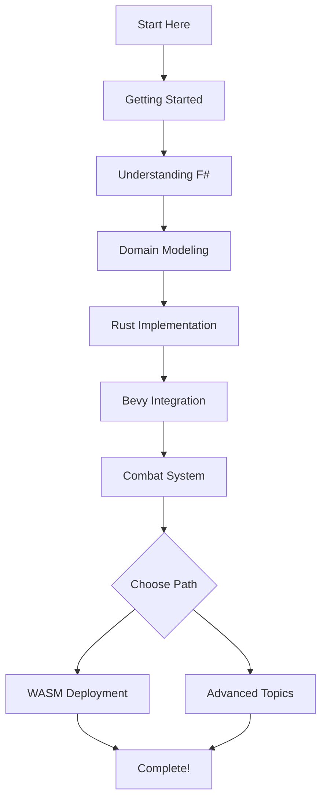

# F# → Rust → Bevy Game Development Tutorial

Welcome to the comprehensive tutorial for building games using F# for domain modeling, Rust for implementation, and Bevy for the game engine. This tutorial series will guide you from zero to a fully functional game that runs both natively and in the browser.

## What You'll Learn

By completing this tutorial series, you'll be able to:

- Design type-safe game domains in F#
- Translate F# models to Rust implementations
- Build game systems with the Bevy ECS
- Deploy games to the web using WASM
- Implement combat systems, AI, and abilities
- Test and optimize your game logic

## Prerequisites

- Basic programming knowledge (Rust or F# helpful but not required)
- A text editor or IDE (VS Code recommended)
- 2-3 hours to complete the full tutorial
- Enthusiasm for learning a unique development workflow

## Tutorial Structure

### Part 1: Foundations

1. **[Getting Started](01-getting-started.md)**
   - Environment setup and toolchain installation
   - Running the reference implementation
   - Understanding the project structure

2. **[Understanding F#](02-understanding-fsharp.md)**
   - F# basics for game developers
   - Functional programming concepts
   - Why F# excels at domain modeling

3. **[Domain Modeling](03-domain-modeling.md)**
   - Designing game types in F#
   - Type-driven development
   - Creating a combat domain model

### Part 2: Implementation

4. **[Rust Implementation](04-rust-implementation.md)**
   - Translating F# to Rust
   - Implementing pure game logic
   - Testing the logic layer

5. **[Bevy Integration](05-bevy-integration.md)**
   - Entity Component System (ECS)
   - Creating game systems
   - Connecting logic to gameplay

6. **[Combat System](06-combat-system.md)**
   - Turn-based combat implementation
   - State machines and events
   - Visual feedback and effects

### Part 3: Deployment & Advanced

7. **[WASM Deployment](07-wasm-deployment.md)**
   - Building for the web
   - Optimization strategies
   - Hosting and distribution

8. **[Advanced Topics](08-advanced-topics.md)**
   - AI decision systems
   - Ability frameworks
   - Performance optimization

### Reference

- **[Troubleshooting](troubleshooting.md)**
  - Common issues and solutions
  - Debugging techniques
  - Community resources

## Learning Path

## Time Estimates

| Chapter | Reading | Exercises | Total |
|---------|---------|-----------|-------|
| Getting Started | 10 min | 20 min | 30 min |
| Understanding F# | 15 min | 15 min | 30 min |
| Domain Modeling | 20 min | 25 min | 45 min |
| Rust Implementation | 15 min | 30 min | 45 min |
| Bevy Integration | 20 min | 25 min | 45 min |
| Combat System | 15 min | 30 min | 45 min |
| WASM Deployment | 10 min | 20 min | 30 min |
| Advanced Topics | 20 min | - | 20 min |

**Total:** Approximately 4-5 hours

## Quick Start

Want to jump right in? Follow these steps:

1. Install Rust and F#
2. Clone the repository
3. Run `cargo run`
4. Start with Chapter 1

## Tutorial Philosophy

This tutorial series follows these principles:

- **Learn by Doing**: Every concept includes hands-on exercises
- **Progressive Complexity**: Start simple, build up gradually
- **Real-World Application**: Everything applies to actual game development
- **Clear Explanations**: We explain the "why" not just the "how"

## Support

- **Repository**: [bevy-wasm-fsharp-ref](https://github.com/raibid-labs/grimware)
- **Issues**: Report problems on GitHub
- **Community**: Join discussions in issues

## Ready?

Let's begin your journey into F# → Rust → Bevy game development!

[Start Tutorial: Getting Started →](01-getting-started.md)